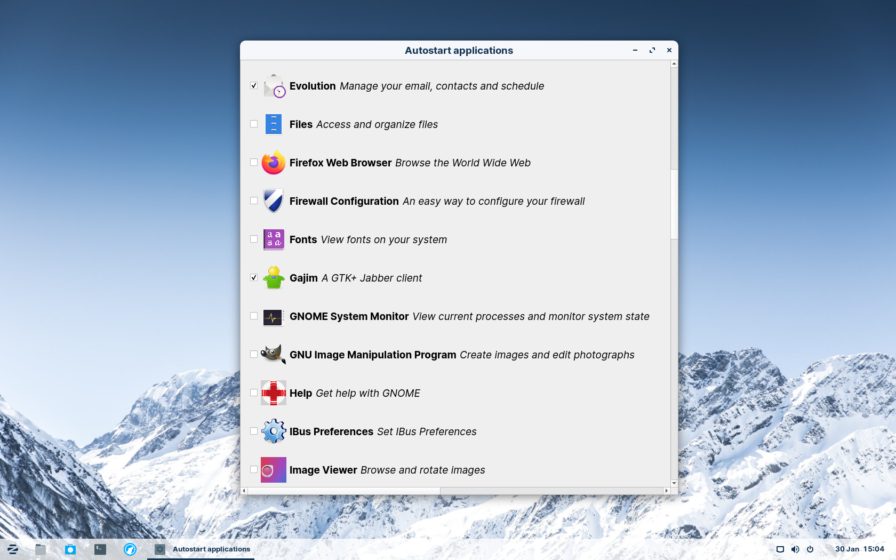

Easy Autostart lets you select applications to run at startup from a list of installed applications. It's intended to be easy to use for non-technical users, and isn't specific to any particular desktop environment. It should work with any desktop environment that uses the standard XDG autostart mechanism.

Tested on [Zorin OS](https://zorin.com/os/) (GNOME; Ubuntu-based)

# Installation

## Packages

There are currently no packages, so you'll have to do manual installation (see below).

If you're interested in making a package for this application, please feel free!

## Manual installation

1. Clone the git repository.

2. Install python3 and python3-pip with your distro's package manager.
For Debian/Ubuntu-based distros this would be:  
    `sudo apt install python3 python3-pip`

3. Install the python library dependencies:  
    `pip install -r requirements.txt`

4. Run install.sh as root to install Easy Autostart:  
    `sudo ./install.sh`

# How to use

Simply click the checkbox for any application you want to launch at startup. Changes are saved immediately, so you can just close the window when you've finished.

# Design

Easy Autostart looks for [.desktop files](https://specifications.freedesktop.org/desktop-entry-spec/desktop-entry-spec-latest.html) of installed applications in the [XDG applications directories](https://specifications.freedesktop.org/menu-spec/menu-spec-latest.html), and enables autostart for them by creating symbolic links to them in the standard [XDG autostart directory](https://specifications.freedesktop.org/autostart-spec/autostart-spec-latest.html) (~/.config/autostart by default). To disable autostart again for an application, it will just delete the symlink.

Different desktop environments seem to have their own mechanisms for configuring autostart for applications, which involve making a copy of the .desktop file to the autostart directory, and modifying fields in the file to enable or disable it.
If a file has been added to the autostart directory outside of Easy Autostart, then Easy Autostart will not interact with it.

## Rationale

The autostart configuration tool in GNOME requires you to set up each application manually by specifying its command, which seems difficult for a non-technical user to do, especially when they might not have an easy way to tell what command runs a certain application.

From a quick search, I didn't find any tools that let you configure autostart by selecting from a list of installed applications and aren't specific to a particular DE, so I decided to make one.

# License

This application is Free Software released into the Public Domain.
